# 🐾 Smart VET — Tech Challenge Fase 2

<details><summary><strong>🎯 Evolução da Estrutura do Projeto</strong></summary>

A Fase 2 foi desenvolvida tendo como base a estrutura de arquivos e pastas estabelecida durante a Fase 1.

Nesta etapa, a estrutura original do projeto foi mantida e evoluída de forma incremental. Foram realizadas alterações em arquivos já existentes do backend e frontend, além da criação de novos arquivos relacionados ao desenvolvimento, segurança, testes automatizados da API e implementação dos algoritmos utilizados no projeto.

Dessa forma, a Fase 2 representa uma evolução incremental da Fase 1, preservando a organização estrutural já definida e adicionando os novos componentes necessários para a evolução do sistema.

A estrutura do projeto na Fase 2 parte diretamente da organização definida na Fase 1.

O objetivo desta etapa não foi substituir ou reconstruir a estrutura existente, mas adicionar e modificar os componentes necessários para atender aos novos requisitos do projeto.

As alterações foram distribuídas entre os diretórios de frontend, backend, testes, documentação visual e implementação com modelos de aprendizado de máquina.

A seguir, é apresentada a estrutura resultante das alterações realizadas durante a Fase 2.

| Arquivo | Status | Descrição |
|---|:---:|---|
| back-end/fastapi/main.py | ✏️ Editado | API atualizada e integração com interpretação por LLM |
| back-end/fastapi/security.py | ➕ Criado | Módulo relacionado à segurança |
| back-end/fastapi/envExample.txt | ✏️ Editado | Atualização das variáveis de ambiente |
| tests/test_api.py | ➕ Criado | Testes automatizados da API |
| front-end/streamlit/app.py | ✏️ Editado | Evolução da interface Streamlit |
| front-end/streamlit/envExample.txt | ✏️ Editado | Atualização das variáveis de ambiente |
| notebooks/modelo-algoritmo-genetico/data.csv | ➕ Criado | Dataset utilizado no desenvolvimento do modelo tabular |
| notebooks/modelo-algoritmo-genetico/Modelo_AG_Algoritmo_Genetico.ipynb | ➕ Criado | Notebook com a implementação do algoritmo genético |
| notebooks/modelo-algoritmo-genetico/artefatos-tabulado-fase1.zip | ➕ Criado | Artefatos do modelo fase 1 |
| notebooks/modelo-algoritmo-genetico/artefatos-tabulado-genetico.zip | ➕ Criado | Artefatos do algoritmo genético |
| assets/imgs/qa0 a qa13.png | ➕ Criados | Evidências visuais da implementação/testes |
| infra/infra.bat | ➕ Criado | Script de Pipeline de Infraestrutura da infraestrutura para Windows |
| infra/infra.sh | ➕ Criado | Script de Pipeline de Infraestrutura da infraestrutura para Linux |
| infra/main.tf | ➕ Criado | Configuração principal do Terraform para definição das variáveis, outputs e providers da infraestrutura |
| infra/envExample.txt | ➕ Criado | Variáveis de ambiente e credenciais utilizadas pelo Terraform |


</details>

---

<details><summary><strong>💬 Integração com LLMs</strong></summary>

Na Fase 2, o Smart VET passou a incluir uma camada de interpretação dos resultados gerados pelos modelos de machine learning. 
- Essa etapa não substitui os modelos tabular e vision 
- ela atua como pós-processamento para transformar saídas numéricas, probabilidades e classes preditas em explicações mais claras para a triagem veterinária

### 🎯 Objetivo


* gerar explicações em linguagem natural dos diagnósticos produzidos pelos modelos

* transformar probabilidades, classes e níveis de confiança em insights acionáveis

* explicitar limitações do resultado para evitar leitura como diagnóstico definitivo

* preparar a arquitetura para a futura integração com dados textuais no Módulo 3

### 🏗️ Arquitetura da interpretação


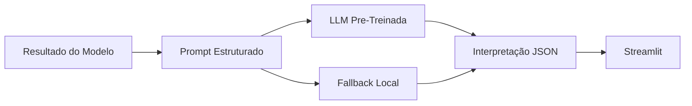

### 🧠 Prompt Engineering

A API monta um prompt com:

- **Tipo de resultado:** modelo tabular ou modelo de imagem
- **Entrada normalizada:** dados utilizados pelo modelo
- **Classe predita:** resultado da classificação
- **Probabilidade ou confiança:** nível associado à predição
- **Idioma:** português do Brasil
- **Restrições clínicas:** não afirmar diagnóstico definitivo ou prescrever tratamento.

A resposta esperada segue um JSON padronizado com:

```json
{
  "summary": "Resumo curto da interpretação",
  "risk_level": "baixo | moderado | alto | indeterminado",
  "explanation": "Explicação em linguagem natural",
  "actionable_insights": ["Ações sugeridas para análise clínica"],
  "limitations": ["Limitações do modelo e da interpretação"],
  "model_used": "Modelo usado na resposta",
  "provider": "gemini | huggingface | openai | rules",
  "generated_by": "llm | rules"
}
```

### ⚙️ Configuração

A integração é opcional. A API tenta os providers configurados em sequência e, se todos falharem ou nenhuma chave estiver configurada, usa um fallback local baseado em regras para manter a demonstração funcional.

`LLM_API_KEY` é a variável genérica recomendada. `OPENAI_API_KEY` continua suportada para compatibilidade com a implementação anterior quando `LLM_PROVIDER=openai` ou quando nenhuma variável `LLM_*` de provider for definida.

Para usar apenas OpenAI no formato legado:

```env
OPENAI_API_KEY=
LLM_PROVIDER=openai
LLM_BASE_URL=https://api.openai.com/v1
LLM_MODEL=gpt-5.6-luna
LLM_JSON_MODE=true
```

Exemplo com Gemini como principal e Hugging Face como alternativa:

```env
LLM_PROVIDER=gemini
LLM_API_KEY=
LLM_BASE_URL=https://generativelanguage.googleapis.com/v1beta/openai
LLM_MODEL=gemini-3.6-flash
LLM_JSON_MODE=true

LLM_FALLBACK_1_PROVIDER=huggingface
LLM_FALLBACK_1_API_KEY=
LLM_FALLBACK_1_BASE_URL=https://router.huggingface.co/v1
LLM_FALLBACK_1_MODEL=Qwen/Qwen2.5-7B-Instruct
LLM_FALLBACK_1_JSON_MODE=true

LLM_TIMEOUT_SECONDS=45
LLM_TEMPERATURE=0.2
```

O campo `response_format={"type":"json_object"}` é controlado por `LLM_JSON_MODE` e `LLM_FALLBACK_1_JSON_MODE`. Quando um provider falha usando JSON mode, a API tenta novamente sem `response_format` antes de seguir para o próximo provider.

### 🔑 Chaves de API

Para usar Gemini, crie uma chave no [Google AI Studio](https://aistudio.google.com/apikey) e configure o valor em `LLM_API_KEY`.

Para usar Hugging Face como fallback, crie um token em [Hugging Face Access Tokens](https://huggingface.co/settings/tokens). Use um token `Fine-grained` com o preset `Inference` habilitado e configure o valor em `LLM_FALLBACK_1_API_KEY`.

As chaves devem ficar somente no arquivo `.env` local ou nas variáveis de ambiente da plataforma de deploy. Não versionar `.env` nem expor tokens no repositório.

### 🧪 Teste da integração

Para validar a integração localmente:

1. Inicie o backend FastAPI em `http://localhost:8000`.
2. Inicie o frontend Streamlit em `http://localhost:8501`.
3. Execute um diagnóstico clínico ou por imagem.
4. Verifique se a tela exibe `Gerado por LLM: gemini / gemini-3.6-flash`.
5. Para testar o fallback, invalide temporariamente `LLM_API_KEY`, reinicie o backend e execute o diagnóstico novamente. A tela deve exibir `Gerado por LLM: huggingface / Qwen/Qwen2.5-7B-Instruct`.

O projeto não utiliza LLM local. Se Gemini e Hugging Face falharem, a API retorna uma interpretação local baseada em regras, sem carregar modelos generativos no computador.

### 📊 Avaliação da qualidade

Para avaliar as interpretações geradas, recomenda-se revisar:

* clareza: se a explicação é compreensível para profissionais de saúde veterinária

* fidelidade: se a LLM não contradiz a classe, probabilidade ou confiança retornada pelo modelo

* segurança: se a resposta evita diagnóstico definitivo e tratamento prescritivo

* utilidade: se os insights ajudam na priorização de triagem e tomada de decisão.

</details>

---

<details><summary><strong>🛡️ QA e Segurança</strong></summary>


### 🎯 Objetivo

Validar a API FastAPI do Smart VET por meio de testes de integração reais, verificando:

- disponibilidade da API
- autenticação por X-API-Key
- diagnóstico por sintomas
- rejeição de imagem inválida
- diagnóstico utilizando imagem real
- contrato das respostas JSON
- configuração necessária para execução

### ▶️ Execução

A execução do projeto e dos testes é realizada exclusivamente pelo arquivo windows.bat.

O script realiza automaticamente:

- validação do Python
- validação dos arquivos .env
- criação/ativação dos ambientes virtuais
- instalação das dependências
- inicialização da API FastAPI
- verificação de http://127.0.0.1:8000/health
- execução do pytest

somente após aprovação dos testes, inicialização do Streamlit.

Comando utilizado:
```
windows.bat
```

Não é necessário executar o pytest manualmente.

### 🧪 Testes automatizados

Arquivo utilizado:
```
tests\test_api.py
```

A suíte contém 7 testes de integração:

| # | Teste | Validação | Resultado esperado | Status |
|:---:|---|---|---|:---:|
| 1 | `/health` | Endpoint público e headers de segurança | `200 OK` | ✅ |
| 2 | `/predict/condition` sem API Key | Ausência de autenticação | `401 Unauthorized` | ✅ |
| 3 | `/predict/condition` com API Key incorreta | Falha de autenticação | `403 Forbidden` | ✅ |
| 4 | Diagnóstico por sintomas | Processamento de entrada válida | `200 OK` | ✅ |
| 5 | Diagnóstico com imagem inválida | Validação do upload | `400 Bad Request` | ✅ |
| 6 | Diagnóstico com imagem real | Processamento e contrato JSON | `200 OK` | ✅ |
| 7 | Configuração da API | Variáveis e imagem de teste | Configuração válida | ✅ |

O teste de imagem utiliza o arquivo real:
```
back-end\fastapi\tests\image-test.jpg
```

Os testes não utilizam TestClient, mocks ou monkeypatch. As requisições são enviadas para a API FastAPI em execução.

### 📋 Casos de teste

A principal evidência de QA é a saída do terminal gerada pelo windows.bat durante a execução do pytest.

Exemplo do trecho esperado:
```
============================================================
                    PYTEST / DEBUG
============================================================

============================= test session starts =============================
platform win32 -- Python 3.13.x, pytest-x.x.x
collected 7 items

test_api.py::test_health_is_public_and_returns_security_headers PASSED
test_api.py::test_condition_prediction_requires_api_key PASSED
test_api.py::test_condition_prediction_rejects_wrong_api_key PASSED
test_api.py::test_condition_diagnosis PASSED
test_api.py::test_invalid_image_is_rejected PASSED
test_api.py::test_image_diagnosis PASSED
test_api.py::test_api_configuration PASSED

============================== 7 passed in ...s ==============================

============================================================
                  PYTEST FINALIZADO
============================================================

[INFO] Exit code do pytest: 0

============================================================
              [OK] PYTEST PASSOU
============================================================
```

Resultado: 7 passed e Exit code do pytest: 0.

O windows.bat somente inicia o Streamlit após o pytest retornar código 0.

### 📸 Evidências de QA

#### 🔐 Autenticação — Diagnóstico por sintomas

A rota de diagnóstico por sintomas foi testada utilizando uma API Key válida.

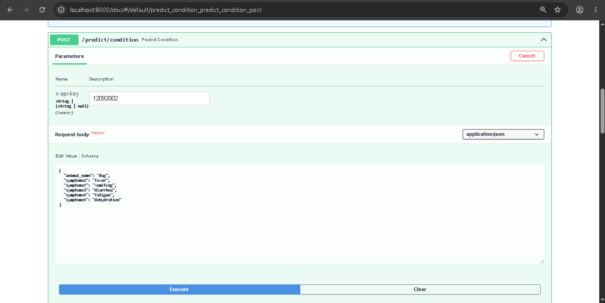

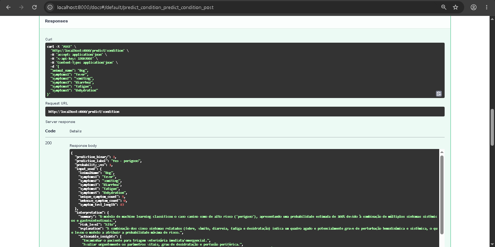

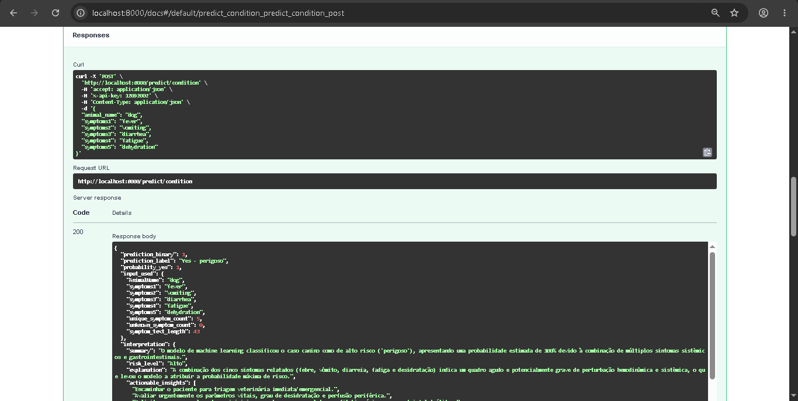

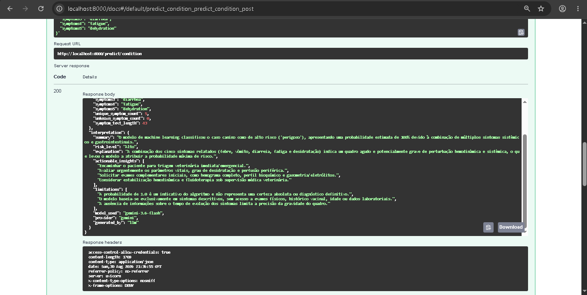

#### 🚫 Requisição sem API Key

Foi realizada uma tentativa de acesso à rota protegida sem informar a API Key.

O comportamento esperado é o retorno de `erro`.

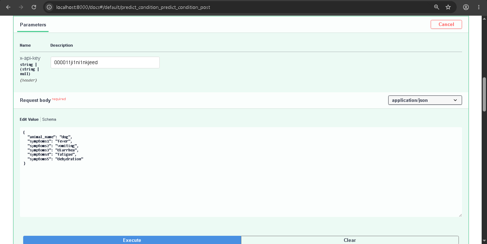

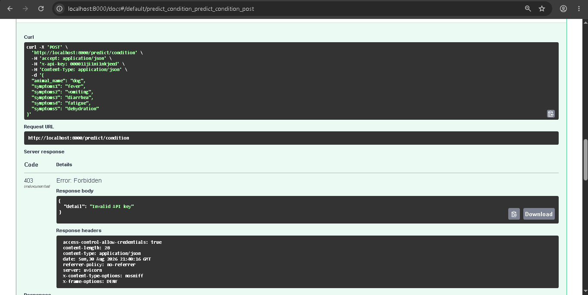

#### 🖼️ Diagnóstico por imagem

A rota de diagnóstico por imagem foi validada utilizando uma API Key válida e uma imagem de teste.

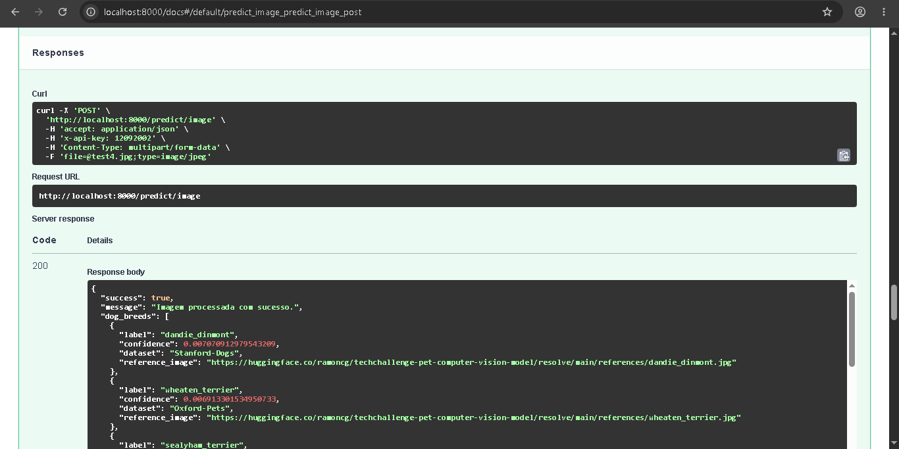

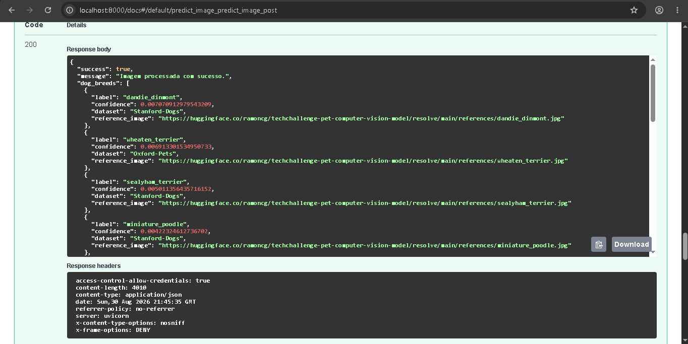

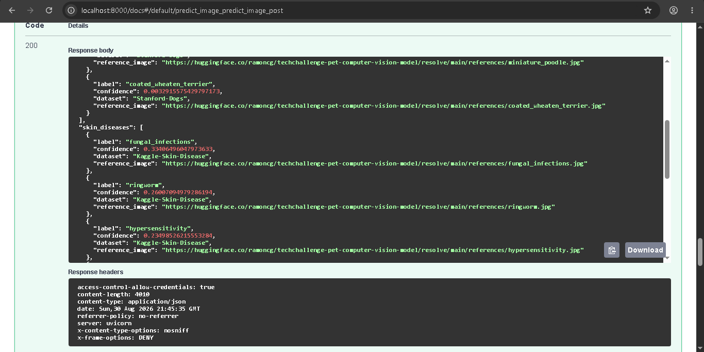

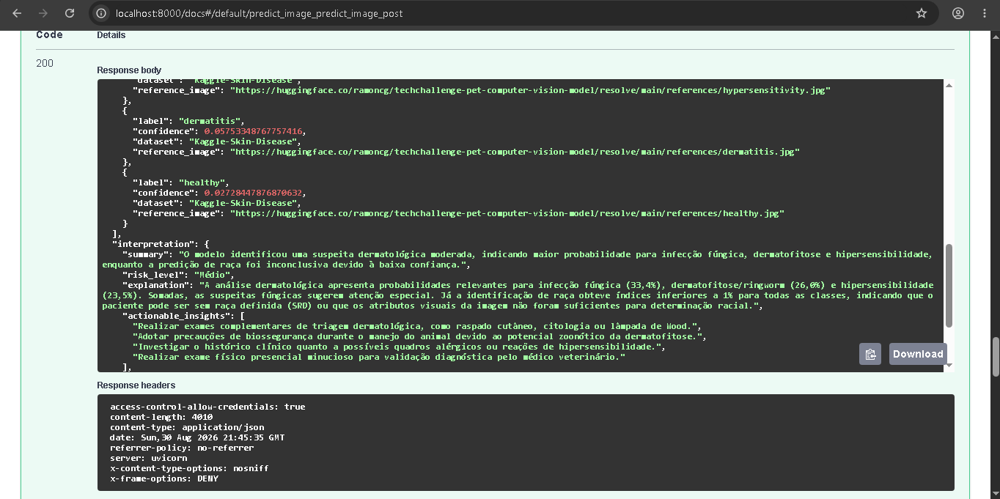

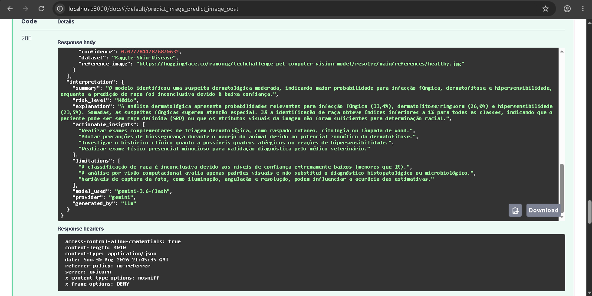

#### ❌ API Key inválida

Foi realizada uma tentativa de acesso à rota de diagnóstico por imagem utilizando uma API Key inválida.

O comportamento esperado é o retorno de `erro`.

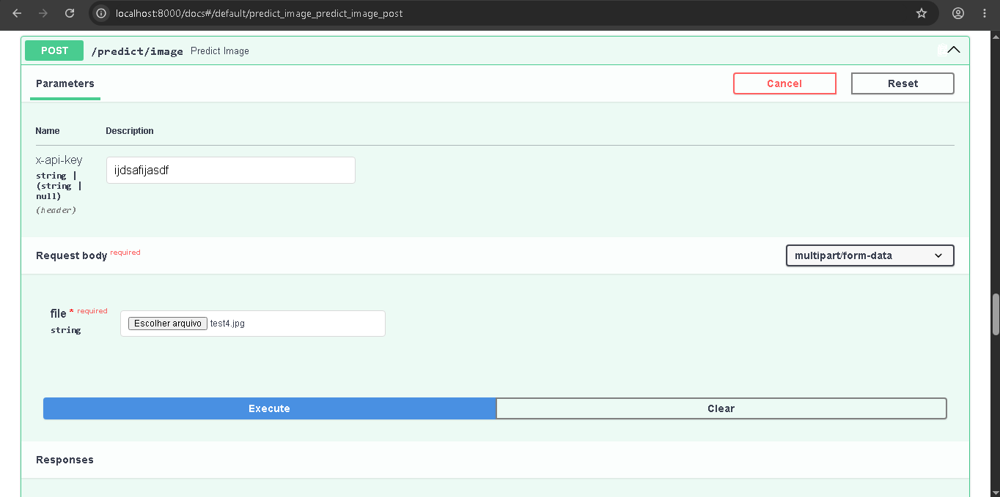

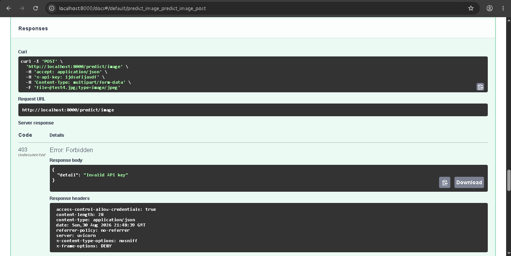

### 🛡️ Segurança
A API possui mecanismos de proteção para autenticação, validação de arquivos, controle de origem e proteção das respostas HTTP.

#### 🔐 Autenticação
Os endpoints de predição (`/predict/*`) são protegidos por autenticação utilizando o header:
```
X-API-Key: SUA_API_KEY
```

Os comportamentos esperados são:

| Situação | HTTP | Comportamento |
|---|:---:|---|
| API Key ausente | `401` | Requisição não autenticada |
| API Key incorreta | `403` | Requisição não autorizada |
| API Key válida | `200` | Requisição processada |

A comparação da API Key utiliza hmac.compare_digest, evitando uma comparação simples de strings.
O endpoint /health permanece público para permitir o monitoramento da disponibilidade da aplicação.

📁 Upload de imagens
Os uploads são protegidos por múltiplas validações:
- Limite máximo de tamanho configurado por MAX_UPLOAD_BYTES
- Limite padrão de 5 MB
- Validação do conteúdo da imagem utilizando Pillow
- Rejeição de arquivos que não correspondam a uma imagem válida
- Retorno HTTP 400 Bad Request para imagens inválidas

🌐 CORS
O acesso entre origens é controlado por meio da variável:
```
ALLOWED_ORIGINS=
```

Dessa forma, a API controla quais origens são autorizadas pelo navegador a realizar requisições conforme a política configurada.

🛡️ HTTP Security Headers

A API adiciona headers de segurança às respostas:

| # | Header | Configuração |
|:---:|---|:---:|
| 1 | X-Content-Type-Options | nosniff |
| 2 | X-Frame-Options | DENY |
| 3 | Referrer-Policy | no-referrer |

🔑 Gerenciamento de credenciais

As credenciais da aplicação são obtidas por meio de variáveis de ambiente.
As chaves reais não devem ser armazenadas no código-fonte ou versionadas no repositório.

⚠️ Nunca utilizar uma API Key real nas evidências, documentação ou arquivos versionados.

```
API
Arquivo de configuração:
back-end\fastapi\.env

Principais variáveis:
API_KEY=SUA_API_KEY_DE_TESTE

Testes
Arquivo de configuração:
tests\.env

Principais variáveis:
TEST_API_URL=http://localhost:8000
TEST_API_KEY=SUA_API_KEY_DE_TESTE
TEST_API_TIMEOUT=120
```

A variável TEST_API_KEY deve corresponder à API_KEY utilizada pela API durante a execução dos testes.

🔒 As chaves utilizadas localmente devem permanecer apenas nos arquivos .env e nunca devem ser versionadas.


### ✅ Critério de aprovação

O QA é considerado aprovado quando todos os testes automatizados são executados com sucesso:

```
7 passed
```

e o windows.bat apresenta:
```
[OK] PYTEST PASSOU
```

O Streamlit somente é inicializado após o retorno do pytest com código de saída 0.

Dessa forma, a inicialização da aplicação frontend fica condicionada à aprovação da suíte de testes automatizados da API.

</details>

---

<details><summary><strong>🧬 Implementação de Algoritmos Genéticos</strong></summary>

## 🎯 Objetivo

Esta implementação aplica Algoritmos Genéticos (AG) à otimização de hiperparâmetros de quatro modelos de classificação:

- Regressão Logística
- Árvore de Decisão
- Random Forest
- KNN

O objetivo principal é encontrar configurações de hiperparâmetros que apresentem bom desempenho de classificação e, ao mesmo tempo, tenham melhor capacidade de generalização.

A implementação atual foi desenvolvida como uma abordagem mais rigorosa em relação à versão anterior, principalmente devido ao forte desbalanceamento da base e à existência de registros com assinaturas semelhantes.

A accuracy não é utilizada isoladamente para selecionar os modelos.

## 📊 Dados utilizados

O dataset utilizado é o arquivo data.csv.

Após a limpeza e remoção de duplicatas, a base possui:

| Indicador | Quantidade |
|---|---:|
| Registros | 841 |
| Grupos únicos | 839 |
| Casos positivos | 821 |
| Casos negativos | 20 |

Os grupos são definidos pela assinatura formada pelo animal e pelos cinco sintomas. Registros pertencentes ao mesmo grupo permanecem na mesma partição, reduzindo o risco de vazamento de informações entre treino, validação e teste.

O forte desbalanceamento da base é um dos principais motivos para não utilizar a accuracy como única métrica.

Um modelo que classifique praticamente todos os registros como positivos pode apresentar accuracy elevada mesmo apresentando desempenho insuficiente para a classe negativa.

## 🔀 Particionamento dos dados

O particionamento utiliza uma estratégia estratificada e agrupada, mantendo registros pertencentes ao mesmo grupo na mesma partição.

A divisão final utilizada possui:

| Conjunto | Registros |
|---|---:|
| Treino | 504 |
| Validação | 169 |
| Teste | 168 |


> ⚠️ Importante: O conjunto de teste permanece intocado durante toda a busca genética.
> Ele é utilizado somente na etapa final para avaliar as configurações selecionadas.
> Essa separação evita utilizar informações do teste para orientar a evolução da população genética.

## 🤖 Modelos avaliados

Foram utilizados quatro classificadores:

### Regressão Logística

Modelo linear utilizado como referência para classificação binária.

Os genes utilizados na otimização são:

| Gene | Descrição |
|---|---|
| `C` | Parâmetro de regularização |
| `class_weight` | Peso atribuído às classes |

### Árvore de Decisão

Modelo baseado em regras de divisão dos dados.

Os genes utilizados são:

| Gene | Descrição |
|---|---|
| `max_depth`	| Profundidade máxima da árvore |
| `min_samples_split`	| Número mínimo de amostras necessário para dividir um nó |
| `min_samples_leaf`	| Número mínimo de amostras permitido em uma folha |
| `class_weight`	| Peso atribuído às classes |

### Random Forest

Modelo ensemble (aprendizado em conjunto) formado por múltiplas árvores de decisão, utilizado para obter uma classificação mais robusta a partir da combinação das árvores.

Os genes utilizados são:

| Gene | Descrição |
|---|---|
| `n_estimators`	| Número de árvores na floresta |
| `max_depth`	| Profundidade máxima de cada árvore |
| `min_samples_split`	| Número mínimo de amostras necessário para dividir um nó |
| `min_samples_leaf`	| Número mínimo de amostras permitido em uma folha |
| `class_weight`	| Peso atribuído às classes |

### KNN

Classificador baseado na proximidade entre amostras.

Os genes utilizados são:

| Gene | Descrição |
|---|---|
| `n_neighbors`	| Número de vizinhos considerados na classificação |
| `weights`	| Estratégia de ponderação dos vizinhos |
| `p`	| Parâmetro da métrica de distância de Minkowski |
| `leaf_size`	| Tamanho da folha utilizado na estrutura de busca |

## 🧬 Representação genética

Cada indivíduo da população representa uma solução candidata para a otimização dos hiperparâmetros de um modelo de classificação.

Os genes representam os hiperparâmetros que podem ser modificados pelo Algoritmo Genético. Cada modelo possui um espaço genético próprio, definido de acordo com os parâmetros disponíveis e os valores aceitos pelo respectivo estimador.

Por exemplo, um indivíduo que representa uma configuração de Random Forest pode ser definido por:

```
[
    n_estimators,
    max_depth,
    min_samples_split,
    min_samples_leaf,
    class_weight
]
```

Nesse caso:

- Indivíduo: uma configuração completa de hiperparâmetros
- Gene: um hiperparâmetro específico da configuração
- Cromossomo: conjunto de genes que representa o indivíduo
- População: conjunto de diferentes indivíduos avaliados pelo algoritmo
- Espaço genético: conjunto de valores possíveis para os genes de cada modelo
- Fitness: pontuação utilizada para medir a qualidade de cada indivíduo

Cada modelo possui seu próprio espaço genético. Dessa forma, os genes disponíveis para Regressão Logística são diferentes dos genes utilizados por Árvore de Decisão, Random Forest e KNN.

Os valores atribuídos aos genes são selecionados a partir de conjuntos de valores válidos para o respectivo estimador, garantindo que as configurações produzidas pelo algoritmo possam ser utilizadas diretamente no treinamento do modelo.

Durante a execução do Algoritmo Genético, os indivíduos são avaliados por meio da função de fitness. Os indivíduos com melhores resultados possuem maior probabilidade de contribuir para a formação das próximas gerações por meio dos operadores de seleção, cruzamento e mutação.

Assim, o processo evolutivo pode ser resumido como:
```
População inicial
       ↓
Avaliação da fitness
       ↓
Seleção dos melhores indivíduos
       ↓
Cruzamento
       ↓
Mutação
       ↓
Nova população
       ↓
Nova avaliação
       ↓
Repetição por várias gerações
```

O objetivo do processo é encontrar, ao longo das gerações, configurações de hiperparâmetros que apresentem melhor desempenho segundo a função de fitness definida para o problema.

## 🌱 Inicialização da população

A população inicial é criada aleatoriamente dentro dos espaços de busca definidos para cada modelo.

Cada indivíduo recebe valores válidos para todos os genes correspondentes ao classificador.

A diversidade inicial permite que o algoritmo explore diferentes regiões do espaço de hiperparâmetros.

## 📈 Avaliação dos indivíduos

Cada configuração genética é avaliada utilizando validação cruzada estratificada por grupos.
Essa estratégia busca preservar a distribuição das classes entre os folds e, simultaneamente, impedir que registros pertencentes ao mesmo grupo sejam utilizados em folds diferentes.
Dessa forma, a avaliação reduz o risco de vazamento de informações entre treinamento e validação.

Para cada indivíduo são calculadas métricas de desempenho nos folds de validação.
As principais métricas utilizadas são:

### Balanced Accuracy
A balanced accuracy considera o desempenho das diferentes classes e reduz o risco de que a classe majoritária domine a avaliação.

### Recall
O Recall recebe peso elevado na função de fitness por representar a capacidade do modelo de identificar corretamente os exemplos da classe positiva.

### F1 Macro
O F1 Macro calcula o desempenho considerando as classes de maneira equilibrada, evitando que o grande número de exemplos positivos esconda um desempenho ruim na classe negativa.

### ROC AUC
A ROC AUC complementa a avaliação considerando a capacidade de separação entre as classes.

A utilização de métricas balanceadas é necessária devido à diferença muito grande entre o número de exemplos positivos e negativos.

## 🏆 Função de Fitness

A função de fitness combina quatro métricas de classificação:

```
fitness =
    0.30 × balanced_accuracy
  + 0.30 × recall
  + 0.30 × f1_macro
  + 0.10 × roc_auc
```

| Métrica | Peso |
|---|---|
| Balanced Accuracy	| 30% | 
| Recall	| 30% |
| F1 Macro	| 30% |
| ROC AUC	| 10% |

A accuracy simples não participa como componente principal da função de fitness devido ao forte desbalanceamento da base.

## 📉 Penalização de instabilidade

Além da fitness média, a implementação considera a variação do desempenho entre os folds.

A fitness ajustada é calculada por:

```
fitness_adjusted =
    fitness
    - 0.20 × desvio_padrao_da_fitness
```

Dessa forma, configurações que apresentam uma média elevada, mas comportamento muito instável entre os folds, podem receber uma pontuação menor.

A penalização favorece configurações mais consistentes.

## 🔄 Operadores do Algoritmo Genético

A evolução da população utiliza quatro mecanismos principais:


### Seleção
Os indivíduos são avaliados pela fitness ajustada e os melhores indivíduos possuem maior probabilidade de participar da geração seguinte.

### Elitismo
Os melhores indivíduos são preservados para evitar que soluções de alta qualidade sejam perdidas durante a evolução.

### Cruzamento
O cruzamento é realizado gene a gene.

Para cada posição genética, o valor pode ser herdado de um dos dois pais.

Exemplo:
```
Pai 1: [100, 10, 2, 1]
Pai 2: [300, 20, 4, 2]

Filho: [100, 20, 2, 2]
```

Os valores continuam pertencendo ao espaço válido do modelo.

### Mutação
A mutação altera genes de forma aleatória dentro dos valores permitidos.

Seu objetivo é manter diversidade na população e permitir a exploração de novas configurações.

## 🧪 Experimentos

Foram executados três experimentos com diferentes tamanhos de população, número de gerações e taxas de mutação.

| Experimento | População | Gerações | Mutação |
|---|---:|---:|---:|
| `R1_pop4_mut10` | 4 | 2 | 10% |
| `R2_pop5_mut25` | 5 | 2 | 25% |
| `R3_pop6_mut45` | 6 | 3 | 45% |

Os experimentos permitem comparar diferentes níveis de exploração do espaço de hiperparâmetros.

O experimento R3 possui maior diversidade genética devido ao aumento da população, do número de gerações e da taxa de mutação.

## 🥇 Seleção do melhor modelo

A seleção do melhor indivíduo é realizada utilizando a fitness ajustada da validação cruzada agrupada.
O conjunto de teste não participa dessa seleção.

Na execução atual, o melhor modelo segundo o processo de seleção foi a:
Regressão Logística do experimento R3_pop6_mut45.

Essa escolha é baseada exclusivamente na avaliação realizada durante a busca genética.
O desempenho observado posteriormente no teste não é utilizado para alterar essa seleção.

## 📊 Resultados no teste

Após a seleção dos modelos, foi realizada a avaliação no conjunto de teste intocado.

Os principais resultados registrados foram:

| Versão | Modelo | Accuracy | Balanced Accuracy | Recall Positivo | F1 Macro | ROC AUC |
|---|---|---:|---:|---:|---:|---:|
| Baseline | Regressão Logística | 0.9762 | 0.5000 | 1.0000 | 0.4940 | 0.6707 |
| Baseline | Random Forest | 0.9762 | 0.5000 | 1.0000 | 0.4940 | 0.7881 |
| Genético R3 | Regressão Logística | 0.9821 | 0.6250 | 1.0000 | 0.6955 | 0.7530 |
| Genético R3 | Random Forest | 0.9464 | 0.7287 | 0.9573 | 0.6399 | 0.6540 |

> ⚠️ **Atenção:** a `Accuracy` não deve ser analisada isoladamente devido ao forte desbalanceamento entre as classes.

A tabela completa dos resultados `comparison_metrics.csv` está armazenada em:

```
\assets\notebooks\modelo-algoritmo-genetico\artefatos_tabulado_genetico.zip
```

## 🔎 Interpretação dos resultados

Os resultados mostram que uma accuracy elevada não significa necessariamente que o modelo esteja classificando corretamente as duas classes.

Por exemplo, a Regressão Logística baseline apresentou:
```
Accuracy = 0.9762
Balanced Accuracy = 0.5000
Recall positivo = 1.0000
F1 Macro = 0.4940
```

A accuracy elevada ocorre em um cenário de forte desbalanceamento, no qual existem muitos mais casos positivos do que negativos.

Uma `Balanced Accuracy` de `0.5000` corresponde ao nível esperado de um classificador que, em média, não apresenta capacidade de discriminação equilibrada entre as duas classes. Apesar da accuracy elevada.

Na nova abordagem, o Random Forest genético R3 apresentou:
```
Accuracy = 0.9464
Balanced Accuracy = 0.7287
Recall positivo = 0.9573
F1 Macro = 0.6399
ROC AUC = 0.6540
```

A redução da `Accuracy` não foi imposta artificialmente. Ela ocorreu como consequência da busca por configurações que apresentassem comportamento mais equilibrado entre as classes, considerando métricas mais adequadas ao cenário desbalanceado.

## 🔬 Comparação com a abordagem anterior

A implementação atual foi estruturada para tratar limitações metodológicas identificadas na abordagem anterior.


| Aspecto | Abordagem atual |
|---|---|
| Métrica principal | Balanced Accuracy, Recall, F1 Macro e ROC AUC |
| Desbalanceamento | Considerado explicitamente |
| Registros semelhantes | Mantidos no mesmo grupo |
| Conjunto de teste | Mantido fora da busca genética |
| F1 Macro | Utilizado na fitness |
| Instabilidade entre folds | Penalizada |
| Seleção do modelo | Baseada na validação, não no teste |

A antiga execução apresentou resultados de accuracy muito elevados. Entretanto, a nova avaliação mostrou que parte desse resultado era influenciada pelo forte desbalanceamento da base.

Por esse motivo, os resultados da execução anterior não devem ser utilizados como referência de desempenho da implementação atual.


## 🌎 Generalização e limitações

A utilização de grupos reduz o risco de que registros com a mesma assinatura de animal e sintomas apareçam simultaneamente em diferentes partições.

Isso torna a avaliação mais rigorosa.

> ⚠️ **Limitação importante:** a base possui apenas 20 exemplos da classe negativa. Portanto, pequenas alterações na divisão dos dados podem produzir variações relevantes nas métricas.

Os resultados apresentados representam uma **avaliação experimental** e não uma validação clínica definitiva.

Para uma avaliação mais robusta, seria necessário:

- ampliar a quantidade de exemplos da classe minoritária
- realizar validação em uma base externa e independente
- avaliar o desempenho em dados coletados fora da base utilizada no treinamento
- realizar análises adicionais de estabilidade e generalização


## 🔁 Reprodutibilidade

A implementação pode ser reproduzida utilizando **Google Colab** ou **Jupyter Notebook**.

### Arquivos necessários

```
assets/
└── notebooks/
    └── modelo-algoritmo-genetico/
        ├── Modelo_AG_Algoritmo_Genetico.ipynb
        └── data.csv
```

### Execução
```
1. Abra `Modelo_AG_Algoritmo_Genetico.ipynb` no Google Colab ou Jupyter Notebook.
2. Mantenha o `data.csv` no diretório esperado pelo notebook.
3. Execute as células na ordem, da primeira à última.
4. Ao final, os resultados serão gerados em `outputs_genetico_robusto/`.
```

As saídas do notebook e esses arquivos contêm os resultados utilizados neste documento.

## 📁 Arquivos gerados

Os principais arquivos e resultados da implementação são armazenados em:

```
outputs_genetico_robusto/
├── tables/
│   ├── comparison_metrics.csv  # Métricas de comparação dos modelos
│   └── genetic_history.csv     # Histórico da evolução genética
│
├── split_summary.json          # Informações sobre a divisão dos dados
│
└── models/
    ├── genetic_parameters.json # Parâmetros encontrados durante a otimização
    ├── selection.json          # Informações relacionadas à seleção dos modelos
    └── best_model.pkl          # Modelo selecionado na execução atual
```

## ✅ Conclusão

A implementação atual utiliza Algoritmos Genéticos para otimizar hiperparâmetros de quatro modelos de classificação: Regressão Logística, Árvore de Decisão, Random Forest e KNN.
A metodologia prioriza métricas mais adequadas ao cenário desbalanceado e utiliza validação agrupada para reduzir o risco de vazamento entre registros semelhantes.

A função de fitness combina `Balanced Accuracy`, `Recall`, `F1 Macro` e `ROC AUC`, enquanto a penalização por desvio padrão busca favorecer configurações mais estáveis entre os folds.
O melhor modelo segundo o processo de seleção genética foi a **Regressão Logística do experimento `R3_pop6_mut45`**.

Os resultados no conjunto de teste demonstram que a `Accuracy` isolada pode fornecer uma visão excessivamente otimista em bases fortemente desbalanceadas. Por esse motivo, as demais métricas devem ser consideradas conjuntamente na interpretação do desempenho.
Apesar dos avanços metodológicos, a base ainda possui apenas **20 exemplos da classe negativa**, o que limita a estabilidade das estimativas.

Portanto, os resultados apresentados devem ser considerados **experimentais** e não representam validação clínica definitiva.
Como próximos passos para aumentar a confiabilidade da avaliação, recomenda-se ampliar a classe minoritária e realizar validação em uma base externa e independente.

</details>

---

<details><summary><strong>🚀 Pipeline de Infraestrutura — Terraform + GitHub + Render Cloud</strong></summary>

## ☁️ Infraestrutura como Código

A infraestrutura do **Smart VET** é provisionada automaticamente utilizando **Terraform**, integrando **GitHub** para versionamento do código e **Render Cloud** para hospedagem dos serviços.

Todo o processo de Pipeline de Infraestrutura da infraestrutura é executado pelo arquivo:

```text
infra.bat
```

A arquitetura pode ser representada da seguinte forma:

```text
.env
  ↓
infra.bat
  ↓
Terraform
  ├── GitHub
  │    └── Repositório Smart VET
  │
  └── Render Cloud
       ├── FastAPI
       └── Streamlit
```

O objetivo dessa abordagem é transformar a configuração da infraestrutura em código, permitindo que o ambiente seja criado de forma automatizada, reproduzível e padronizada.

---

## 🎯 Objetivo

A implementação com Terraform automatiza o processo necessário para disponibilizar o Smart VET na nuvem.

O pipeline é responsável por:

- configurar as credenciais e variáveis da infraestrutura;
- inicializar e validar o Terraform;
- criar o repositório no GitHub;
- configurar o Git local;
- realizar o commit inicial;
- enviar o projeto para o GitHub;
- criar o serviço FastAPI no Render;
- criar o serviço Streamlit no Render;
- configurar as variáveis de ambiente dos serviços;
- obter as URLs geradas pelo Render;
- disponibilizar o ambiente completo sem criação manual dos recursos.

---

## 🏗️ Arquitetura do Pipeline

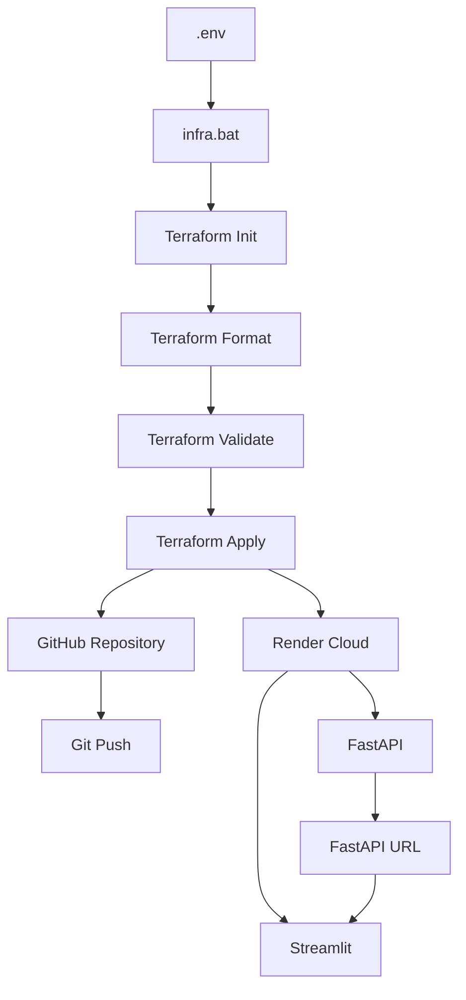

O `infra.bat` funciona como ponto de entrada do pipeline.

Ele lê as configurações do `.env`, transforma cada configuração em uma variável `TF_VAR_*` e executa os comandos necessários para o Terraform provisionar os recursos.

---

## 📁 Estrutura da Infraestrutura

Os principais arquivos relacionados ao provisionamento são:

```text
src/
└── infra/
    ├── .env
    ├── .envexemplo.txt
    ├── infra.bat
    ├── main.tf
    └── README.md
```

### `.env`

Contém as configurações utilizadas durante o provisionamento.

O arquivo é utilizado pelo `infra.bat` para alimentar as variáveis do Terraform.

As credenciais não devem ser armazenadas no código-fonte.

```text
.env
```

deve permanecer fora do versionamento.

O arquivo:

```text
.envexemplo.txt
```

é utilizado como referência para criação do ambiente local.

---

## ⚙️ Pipeline de Infraestrutura com `infra.bat`

O `infra.bat` centraliza o processo de implantação da infraestrutura no Windows.

Durante a execução, o script:

```text
1. Verifica arquivos e diretórios necessários
       ↓
2. Carrega o .env
       ↓
3. Valida as configurações obrigatórias
       ↓
4. Verifica Git
       ↓
5. Verifica Terraform
       ↓
6. Cria as variáveis TF_VAR_*
       ↓
7. Executa terraform init
       ↓
8. Executa terraform fmt
       ↓
9. Executa terraform validate
       ↓
10. Cria o repositório GitHub
       ↓
11. Configura o Git local
       ↓
12. Realiza o commit inicial
       ↓
13. Executa git push
       ↓
14. Cria os serviços no Render
       ↓
15. Exibe as URLs geradas
```

Para executar:

```bat
infra.bat
```

O processo completo é realizado automaticamente a partir do diretório:

```text
src/infra
```

---

## 🧱 Terraform

O arquivo principal da infraestrutura é:

```text
main.tf
```

Ele define os recursos que serão criados na nuvem e suas respectivas configurações.

O projeto utiliza os providers:

```text
integrations/github
render-oss/render
```

O Terraform é responsável por transformar a configuração declarativa em recursos reais na infraestrutura.

---

## 🐙 GitHub

O Terraform cria automaticamente o repositório definido pela variável:

```env
GITHUB_REPOSITORY=Smart_VET
```

A configuração também permite definir:

```env
GITHUB_OWNER=
GITHUB_TOKEN=
GITHUB_REPOSITORY=
GITHUB_VISIBILITY=
GIT_USER_NAME=
GIT_USER_EMAIL=
```

Onde:

| Variável | Função |
|---|---|
| `GITHUB_OWNER` | Usuário ou organização proprietária do repositório |
| `GITHUB_TOKEN` | Token utilizado para autenticação no GitHub |
| `GITHUB_REPOSITORY` | Nome do repositório |
| `GITHUB_VISIBILITY` | Define se o repositório será `private` ou `public` |
| `GIT_USER_NAME` | Nome utilizado nos commits |
| `GIT_USER_EMAIL` | E-mail utilizado nos commits |

Após a criação do repositório, o `infra.bat` configura o Git local e envia o projeto para o GitHub.

O fluxo é:

```text
Terraform
    ↓
GitHub Repository
    ↓
Git Init / Configuração
    ↓
Git Add
    ↓
Git Commit
    ↓
Git Push
```

---

## ☁️ Render Cloud

O **Render Cloud** é utilizado como plataforma de hospedagem dos serviços da aplicação.

A infraestrutura cria dois serviços principais:

```text
Render Cloud
├── FastAPI
└── Streamlit
```

As configurações principais são:

```env
RENDER_API_KEY=
RENDER_OWNER_ID=
RENDER_REGION=oregon
RENDER_PLAN=free
```

### FastAPI

O backend é provisionado como Web Service utilizando o Dockerfile:

```text
src/back-end/fastapi/Dockerfile
```

As principais configurações são:

```env
FASTAPI_SERVICE_NAME=
FASTAPI_BRANCH=
FASTAPI_ROOT_DIRECTORY=
```

O serviço recebe automaticamente as variáveis relacionadas à:

- API;
- autenticação;
- Hugging Face;
- modelos;
- LLM;
- configurações de execução.

### Streamlit

O frontend também é provisionado como Web Service no Render.

O Dockerfile utilizado é:

```text
src/front-end/streamlit/Dockerfile
```

As configurações principais são:

```env
STREAMLIT_SERVICE_NAME=
STREAMLIT_BRANCH=
STREAMLIT_ROOT_DIRECTORY=
```

O Streamlit recebe principalmente:

```env
API_KEY=
SMART_VET_API_KEY=
FASTAPI_URL=
```

A variável `FASTAPI_URL` pode ser calculada automaticamente pelo Terraform utilizando a URL gerada para o serviço FastAPI.

---

## 🔐 Variáveis de Ambiente

As variáveis utilizadas pela infraestrutura são organizadas por responsabilidade.

### GitHub

```env
GITHUB_OWNER=
GITHUB_TOKEN=
GITHUB_REPOSITORY=
GITHUB_VISIBILITY=
GIT_USER_NAME=
GIT_USER_EMAIL=
```

### Render

```env
RENDER_API_KEY=
RENDER_OWNER_ID=
RENDER_REGION=oregon
RENDER_PLAN=free
```

### FastAPI

```env
FASTAPI_SERVICE_NAME=
FASTAPI_BRANCH=
FASTAPI_ROOT_DIRECTORY=
```

### Streamlit

```env
STREAMLIT_SERVICE_NAME=
STREAMLIT_BRANCH=
STREAMLIT_ROOT_DIRECTORY=
```

### API

```env
API_ENV=production
API_KEY=
SMART_VET_API_KEY=
MAX_UPLOAD_BYTES=
ALLOWED_ORIGINS=
FASTAPI_URL=
```

### Hugging Face

```env
HF_MODEL_REPO=
HF_MODEL_FILENAME=
HF_DATA_REPO=
HF_DATA_FILENAME=
HF_IMAGE_REPO=
HF_IMAGE_FILENAME=
```

### LLM Principal

```env
LLM_PROVIDER=
LLM_API_KEY=
LLM_BASE_URL=
LLM_MODEL=
LLM_JSON_MODE=
```

### LLM Fallback

```env
LLM_FALLBACK_1_PROVIDER=
LLM_FALLBACK_1_API_KEY=
LLM_FALLBACK_1_BASE_URL=
LLM_FALLBACK_1_MODEL=
LLM_FALLBACK_1_JSON_MODE=
```

### Configuração do LLM

```env
LLM_TIMEOUT_SECONDS=
LLM_TEMPERATURE=
```

As credenciais reais devem permanecer exclusivamente no `.env` local ou nas variáveis de ambiente do ambiente de execução.

O arquivo `.env` não deve ser versionado.

---

## 🔄 Estratégia de Provisionamento

O provisionamento utiliza dois momentos principais de `terraform apply`.

### 1. Criação do GitHub

Primeiro é criado o repositório necessário para disponibilizar o código:

```bash
terraform apply -auto-approve -target=github_repository.smart_vet
```

Essa etapa permite que o repositório exista antes da criação dos serviços dependentes do código hospedado no GitHub.

### 2. Envio do código

Depois da criação do repositório, o `infra.bat` configura o Git e realiza o envio do projeto:

```text
GitHub Repository
      ↑
      │
   git push
      │
Código local
```

### 3. Provisionamento completo

Após o código estar disponível no GitHub, o Terraform executa:

```bash
terraform apply -auto-approve
```

Nesse momento são criados os serviços do Render.

```text
GitHub
   ↓
Render Cloud
   ├── FastAPI
   └── Streamlit
```

---

## 🧪 Validação do Terraform

Antes da criação dos recursos, o pipeline executa:

```bash
terraform init
```

Inicializa o projeto e instala os providers necessários.

Depois:

```bash
terraform fmt
```

Padroniza a formatação dos arquivos Terraform.

Em seguida:

```bash
terraform validate
```

Verifica se a configuração está válida antes do provisionamento.

Somente após essas etapas o processo continua.

---

## 🔗 Integração entre os Serviços

Após o provisionamento, o fluxo de comunicação da aplicação é:

```text
Usuário
   ↓
Streamlit
   ↓
FastAPI
   ↓
Modelos / LLM / Dados
```

A infraestrutura conecta o frontend ao backend por meio da URL do FastAPI.

```text
Render Cloud
│
├── FastAPI
│     └── https://<fastapi>.onrender.com
│
└── Streamlit
      └── https://<streamlit>.onrender.com
```

A URL do backend é disponibilizada para o Streamlit por meio da variável:

```env
FASTAPI_URL=
```

Dessa forma, a comunicação entre frontend e backend não depende de URLs locais como:

```text
http://localhost:8000
```

---

## 🚀 Execução Completa

### 1. Criar o `.env`

Copie:

```text
.envexemplo.txt
```

para:

```text
.env
```

Configure as credenciais necessárias, principalmente:

```env
GITHUB_TOKEN=
RENDER_API_KEY=
RENDER_OWNER_ID=
API_KEY=
SMART_VET_API_KEY=
LLM_API_KEY=
LLM_FALLBACK_1_API_KEY=
```

### 2. Executar o Pipeline de Infraestrutura

No diretório:

```text
src/infra
```

execute:

```bat
infra.bat
```

### 3. Aguardar o provisionamento

O pipeline executará automaticamente:

```text
.env
 ↓
infra.bat
 ↓
Terraform
 ↓
GitHub
 ↓
Git Push
 ↓
Render Cloud
 ↓
FastAPI + Streamlit
```

### 4. Acessar os serviços

Ao finalizar, o script apresenta as URLs geradas:

```text
GitHub:    URL do repositório
FastAPI:   URL do serviço
Streamlit: URL do serviço
```

Essas URLs representam o ambiente provisionado na nuvem.

---

## 🛡️ Segurança da Infraestrutura

O processo foi estruturado para evitar que credenciais sejam incorporadas diretamente ao código Terraform.

As credenciais são fornecidas por variáveis de ambiente:

```text
.env
   ↓
infra.bat
   ↓
TF_VAR_*
   ↓
Terraform
```

O `.env` deve permanecer fora do controle de versão.

Nunca versionar:

```env
GITHUB_TOKEN=token-real
RENDER_API_KEY=chave-real
LLM_API_KEY=chave-real
SMART_VET_API_KEY=chave-real
```

O repositório deve conter apenas arquivos de exemplo sem credenciais reais.

---

## 📐 Infraestrutura como Código

A utilização do Terraform permite que a infraestrutura seja descrita de forma declarativa.

Em vez de criar manualmente:

```text
GitHub Repository
Render Service
Environment Variables
Deploy Configuration
```

essas configurações ficam representadas no código:

```text
main.tf
```

O resultado é uma infraestrutura:

- automatizada;
- reproduzível;
- versionável;
- documentada;
- padronizada;
- facilmente reconfigurável.

A infraestrutura deixa de depender de configurações manuais realizadas diretamente nos painéis das plataformas.

---

## 🔁 Pipeline End-to-End

O fluxo completo do Smart VET pode ser resumido em:

```text
                 SMART VET
                     │
                     ▼
                  .env
                     │
                     ▼
                infra.bat
                     │
                     ▼
                 Terraform
                     │
          ┌──────────┴──────────┐
          ▼                     ▼
       GitHub                Render Cloud
          │                     │
          │             ┌───────┴───────┐
          │             ▼               ▼
          │          FastAPI        Streamlit
          │             │               │
          │             └───────┬───────┘
          │                     │
          └──────────────► Deploy
                                │
                                ▼
                           Smart VET Cloud
```

Essa arquitetura permite que o código e a infraestrutura evoluam juntos, mantendo o processo de implantação automatizado desde o ambiente local até a aplicação disponibilizada na nuvem.

---

## 🎥 Demonstração

A demonstração em vídeo apresenta o fluxo completo de provisionamento e publicação da infraestrutura, incluindo:

- execução do `infra.bat`;
- inicialização do Terraform;
- criação do repositório no GitHub;
- configuração do Git;
- envio do código;
- provisionamento do Render;
- criação do FastAPI;
- criação do Streamlit;
- geração das URLs;
- acesso à aplicação hospedada na nuvem.

> 🎬 **Vídeo de demonstração da infraestrutura:**  
> Adicionar aqui o link ou embed do vídeo utilizado na entrega.

---

## 🏁 Resultado Final

A implementação transforma o processo de infraestrutura do Smart VET em um pipeline automatizado:

```text
Configuração
     ↓
Automação
     ↓
Infraestrutura como Código
     ↓
Versionamento
     ↓
Provisionamento Cloud
     ↓
Deploy
     ↓
Aplicação disponível
```

Com isso, **GitHub + Terraform + Render Cloud** formam uma cadeia automatizada de infraestrutura, permitindo que o ambiente do Smart VET seja provisionado de maneira consistente e reproduzível a partir de um único ponto de entrada:

```text
infra.bat
```
# Links

- [Git — YouTube](https://www.youtube.com/watch?v=Jx_RM4p7NrM)
- [Git para Windows — Instalação](https://git-scm.com/install/windows)
- [Git / GitHub — YouTube](https://www.youtube.com/watch?v=pSJz4DzvbFI)
- [Git Credential Documentation](https://git-scm.com/docs/git-credential)
- [Terraform — Instalação](https://developer.hashicorp.com/terraform/install)
- [Terraform — YouTube](https://www.youtube.com/watch?v=bSrV1Dr8py8)
- [Terraform Render Provider](https://registry.terraform.io/providers/render-oss/render/latest/docs)
- [Terraform GitHub Provider](https://registry.terraform.io/providers/integrations/github/latest/docs)
- [Terraform Render Web Service](https://registry.terraform.io/providers/render-oss/render/latest/docs/resources/web_service)

</details>

---

<details><summary><strong>🔎 Endpoints e Video</strong></summary>

## 🖥️ Endpoints
* 🌐 [Smart VET FastAPI e Streamlit no readme principal](./README.MD)

---

## 🖥️ Video

* 🌐 [Video Smart VET no readme principal](./README.MD)


</details>
