<a id="readme-top"></a>

<div align="right">
	<spam>Idiomas</spam>

[](README.md)

</div>

<p align="center">
  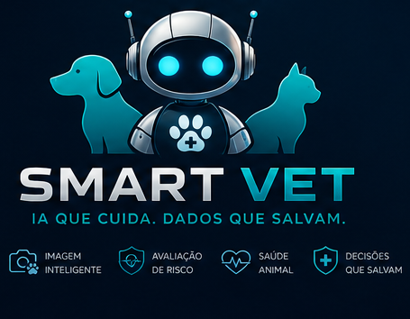
</p>

---

<strong>📑 Índice</strong>

🔹 [🤖 Apresentação Smart VET](#-apresentação-smart-vet)

🔹 [📈 Status do Projeto](#-status-do-projeto)

🔹 [🗂️ Estrutura de Arquivos e Pastas](#️-estrutura-de-arquivos-e-pastas)

🔹 [📐 Desenho do Sistema](#-desenho-do-sistema)

🔹 [🏗️ Arquitetura e Fluxo de Interação](#️-arquitetura-e-fluxo-de-interação)

🔹 [🔄 Pipeline Completo da IA](#-pipeline-completo-da-ia)

🔹 [⚙️ Executando o Projeto Localmente](#️-executando-o-projeto-localmente)

🔹 [☁️ Deploy na Cloud Render](#️-deploy-na-cloud-render)

🔹 [📚 Glossário](#-glossário)

🔹 [📋 Referências](#-referências)

🔹 [📝 Autores](#-autores)

🔹 [⚖️ Licença](#️-licença)

---

# 🤖 Apresentação Smart VET

<div align="center">


📄 [**Smart-VET-Relatório.pdf**](./assets/docs/relatorio.pdf) 
📄 [**Smart-VET-Tabular.pdf**](./assets/docs/smart-vet-tabular.pdf) 
📄 [**Smart-VET-Vision.pdf**](./assets/docs/smart-vet-vision.pdf) 

</div>

<div align="center">


  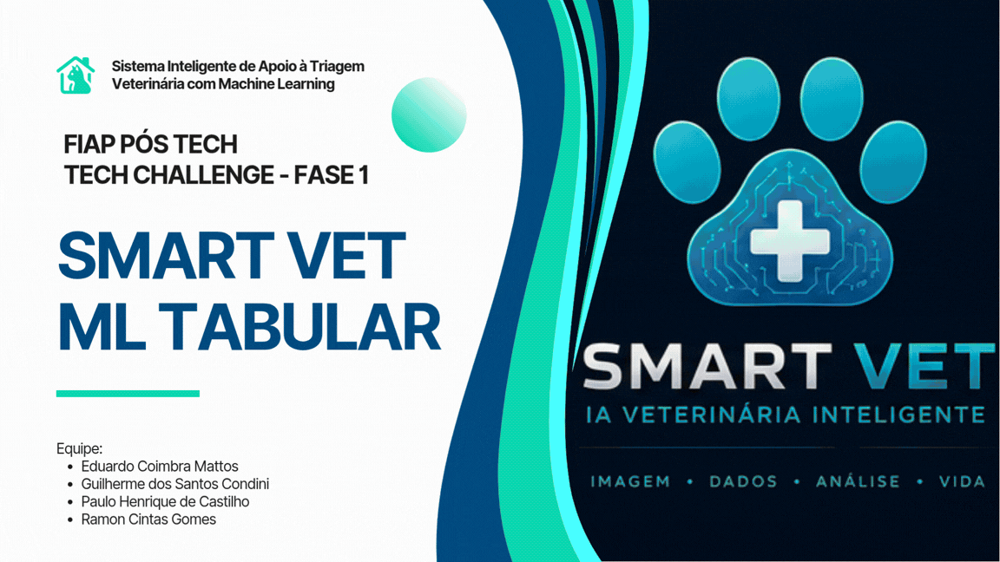
  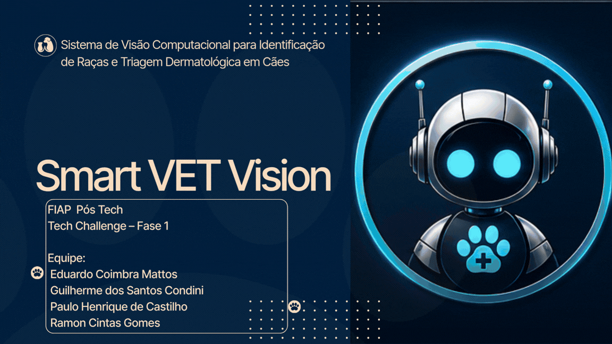

  

  <div style="display: flex; justify-content: center; gap: 20px; flex-wrap: wrap;">
    
    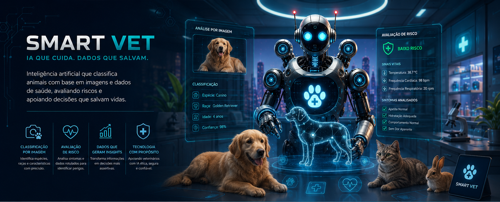
  </div>

  

</div>

---

# 📈 Status do projeto

> [!NOTE]
> ☁️ Hospedado na Cloud Render e Huggingface

> [!TIP]
> 🔎 Qualquer feedback entrar em contato com os desenvolvedores

---

**Resultado**

> [!IMPORTANT]
> 🛰️ Projeto concluído

> [!CAUTION]
> ⛔ Após a apresentação o projeto será excluído das plataformas de hospedagem

---
## 🔗 Repositórios Oficiais do Projeto
* 🐙 [Smart VET Repository (GitHub)](https://github.com/RamonCintas/Smart_VET)
* 🤗 [Smart VET Vision Model](https://huggingface.co/ramoncg/techchallenge-pet-computer-vision-model/tree/main)
* 🤗 [Smart VET Race and Disease Dataset](https://huggingface.co/datasets/ramoncg/techchallenge-animal-race-and-disease-dataset/tree/main)
* 🤗 [Smart VET Animal Condition Dataset](https://huggingface.co/datasets/guicon/techchallenge-animal-condition-dataset/tree/main)
* 🤗 [Smart VET Animal Condition Model](https://huggingface.co/guicon/techchallenge-animal-condition-model/tree/main)
---
## 🖥️ Endpoints
* 🌐 [Smart VET Streamlit Render](https://smart-vet-streamlit.onrender.com/)
* 🌐 [Smart VET FastAPI Render](https://smart-vet-fastapi.onrender.com/docs)
---

* 🚀 [Video Smart VET no youtube](https://www.youtube.com/watch?v=_kzFBY4bn_M)

<div align="center">

<a href="https://www.youtube.com/watch?v=_kzFBY4bn_M" target="_blank" aria-label="Acessar o vídeo do projeto no YouTube">
 </a>

<details>
  <summary>Descrição da Imagem</summary>
  Esta imagem contém o logotipo do YouTube em movimento, sugerindo que o usuário pode clicar para assistir ao vídeo do projeto. O logotipo está centralizado, e o GIF cria uma sensação de interatividade. Ao clicar na imagem, o usuário será redirecionado para o vídeo do projeto no YouTube.
</details>

</div>

---

# 🗂️ Estrutura de arquivos e pastas

```
SMART_VET-MAN/                                              # Diretório raiz do projeto Smart VET
│
├── assets/                                                 # Recursos auxiliares do projeto
│   │
│   ├── docs/                                               # Documentação técnica e apresentações
│   │   ├── deploy-render-fastapi.pdf                       # Guia de deploy do backend no Render
│   │   ├── deploy-render-streamlit.pdf                     # Guia de deploy do frontend no Render
│   │   ├── relatorio.pdf                                   # Relatório técnico principal do Tech Challenge
│   │   ├── smart-vet-tabular.pdf                           # Slides da apresentação Smart VET (modelo tabular)
│   │   └── smart-vet-vision.pdf                            # Slides da apresentação Smart VET Vision (modelo visão)
│   │
│   ├── imgs/                                               # Imagens e assets visuais usados no README e apresentações
│   │   ├── pipeline.svg                                    # Imagem do mermaid do pipeline do projeto
│   │   ├── arquitetura-fluxo.svg                           # Imagem do mermaid do pipeline do projeto
│   │   ├── desenho-sistema.svg                             # Imagem do mermaid do pipeline do projeto
│   │   ├── banner1.png                                     # Banner promocional do projeto
│   │   ├── banner2.png                                     # Banner promocional alternativo
│   │   ├── logo.png                                        # Logo oficial do Smart VET
│   │   ├── render-status.webp                              # Screenshot/status do deploy no Render
│   │   ├── smart-vet-tabular.gif                           # GIF demonstrativo do modelo tabular
│   │   ├── smart-vet-vision.gif                            # GIF demonstrativo do modelo vision
│   │   ├── test1.jpg                                       # Imagem de teste para inferência
│   │   ├── test2.png                                       # Imagem de teste para inferência
│   │   ├── test3.webp                                      # Imagem de teste para inferência
│   │   ├── test4.jpg                                       # Imagem de teste para inferência
│   │   └── uptimerobot-ping-http.webp                      # Exemplo de configuração do UptimeRobot
│   │
│   ├── notebooks/                                          # Notebooks de experimentação e treinamento
│   │   │
│   │   ├── modelo-image-raca-e-doenca/                     # Modelo híbrido (raça + doença) CNN para identificação de raças e triagem dermatológica
│   │   │   └── Modelo_Dog_raca_doenca.ipynb                # Notebook principal de classificação de raças e doenças
│   │   │
│   │   ├── modelo-tabular/                                 # Modelo tabular (Machine Learning clássico)
│   │   │   └── Modelo_Tabulado.ipynb                       # Notebook principal do pipeline tabular
│   │   │
│   │   └── envExample-google-colab.txt                     # Configuração de ambiente para Google Colab
│   │
│   └── tech_challenge_a_b/                                 # Arquivos oficiais do desafio Tech Challenge
│       ├── IADT-Fase-1-Tech-challenge-A.pdf                # Documento oficial da Fase A
│       └── IADT-Fase-1-Tech-challenge-B.pdf                # Documento oficial da Fase B
│
├── src/                                                    # Código-fonte principal da aplicação
│   │
│   ├── back-end/                                           # Backend do sistema
│   │   └── fastapi/
│   │       ├── Dockerfile                                  # Configuração Docker do backend
│   │       ├── envExample.txt                              # Variáveis de ambiente do backend
│   │       ├── main.py                                     # API principal FastAPI
│   │       └── requirements.txt                            # Dependências Python do backend
│   │
│   ├── front-end/                                          # Frontend da aplicação
│   │   └── streamlit/
│   │       ├── app.py                                      # Aplicação principal Streamlit
│   │       ├── Dockerfile                                  # Configuração Docker do frontend
│   │       ├── envExample.txt                              # Variáveis de ambiente do frontend
│   │       └── requirements.txt                            # Dependências Python do frontend
│   │
│   ├── linux.sh                                            # Script de inicialização automática para Linux
│   └── windows.bat                                         # Script de inicialização automática para Windows
│
├── CODE_OF_CONDUCT.md                                      # Código de conduta para colaboradores
├── LICENSE.txt                                             # Licença de uso do projeto
├── README.md                                               # Documentação principal do repositório
└── SECURITY.md                                             # Política de segurança e reporte de vulnerabilidades
```

---

# 📐 Desenho do Sistema

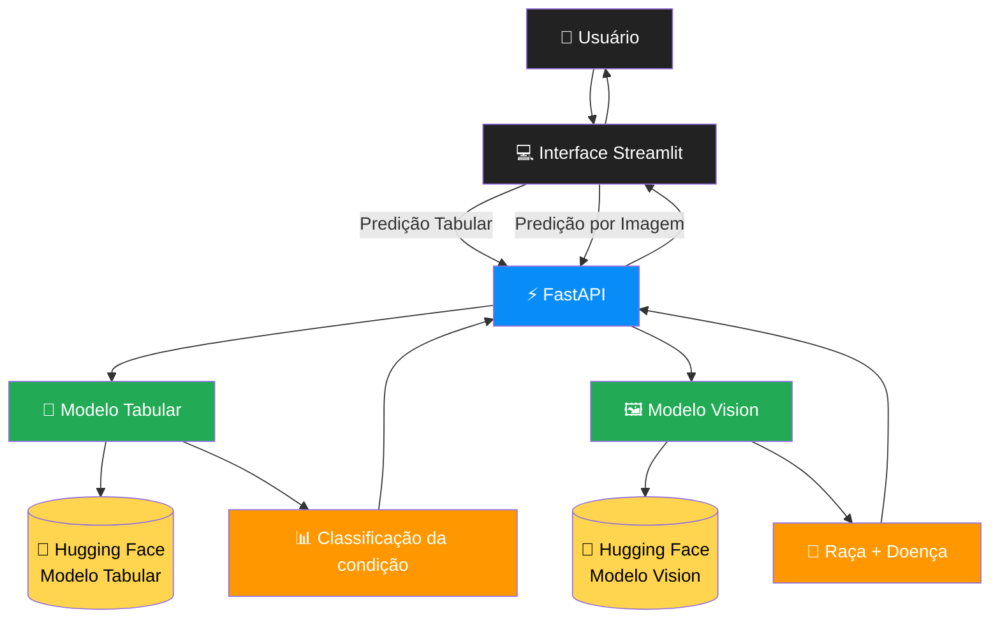

---

> [!warning]
> 🚧 O GitHub Mobile não possui suporte ao Mermaid. Abaixo pode ser exibido a imagem correspondente


---

## 📘 Descrição

O Smart VET possui dois modelos de Inteligência Artificial disponíveis através de uma única API.

O usuário acessa a interface Streamlit e pode escolher entre duas funcionalidades.

### Modelo Tabular

O usuário informa:

* espécie

* sintomas

* informações clínicas

A FastAPI envia esses dados ao modelo tabular treinado, responsável por prever se o quadro do animal representa uma condição potencialmente grave.

---

### Modelo Vision

O usuário envia uma fotografia do animal.

A FastAPI realiza:

* leitura da imagem

* pré-processamento

* normalização

* inferência utilizando EfficientNetV2

O resultado contém:

* raça

* possível doença dermatológica

---

Ambos os resultados retornam para a interface Streamlit em tempo real.

---

# 🏗️ Arquitetura e Fluxo de Interação

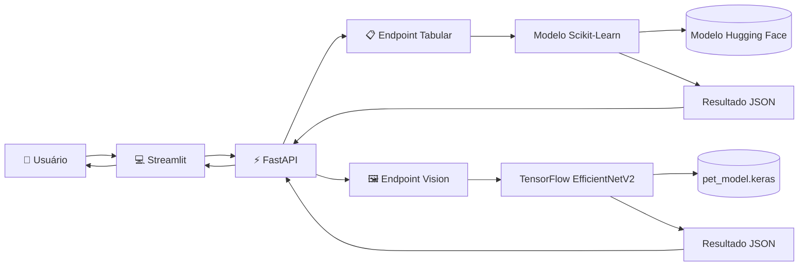

---

> [!warning]
> 🚧 O GitHub Mobile não possui suporte ao Mermaid. Abaixo pode ser exibido a imagem correspondente


---

## 📘 Fluxo

### 1. Usuário

Acessa o Smart VET pelo navegador.

---

### 2. Streamlit

Exibe duas funcionalidades.

Predição clínica.

Predição por imagem.

---

### 3. FastAPI

Recebe as requisições HTTP.

Valida os dados.

Seleciona o modelo adequado.

---

### 4. Modelo Tabular

Realiza:

* engenharia de atributos

* transformação

* inferência

Retorna:

```text
Condição Grave

ou

Condição Não Grave
```

---

### 5. Modelo Vision

Recebe uma imagem.

Realiza:

* resize

* preprocessamento

* normalização

* inferência

Retorna:

```text
Raça

Doença dermatológica

Probabilidade
```

---

### 6. Resultado

A API devolve um JSON.

O Streamlit apresenta o resultado ao usuário.

---

# 🔄 Pipeline Completo da IA

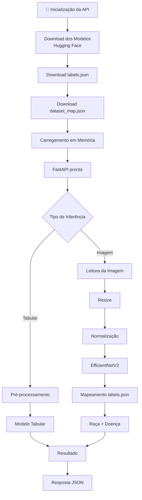

---

> [!warning]
> 🚧 O GitHub Mobile não possui suporte ao Mermaid. Abaixo pode ser exibido a imagem correspondente


---

## 📘 Descrição do Pipeline

O pipeline do Smart VET é dividido em duas fases.

### ⚙️ Inicialização

Quando a FastAPI inicia:

* realiza o download dos modelos do Hugging Face;

* baixa `pet_model.keras`;

* baixa `labels.json`;

* baixa `dataset_map.json`;

* carrega tudo em memória.

Essa etapa ocorre apenas uma vez durante o ciclo de vida da aplicação.

---

### 🚀 Runtime

A cada requisição:

* o usuário envia dados tabulares ou uma imagem;

* a FastAPI identifica qual modelo utilizar;

* executa a inferência correspondente;

* converte a saída para JSON;

* devolve o resultado ao Streamlit.

Nenhum download adicional do Hugging Face é realizado durante as previsões, reduzindo significativamente a latência.

---

# ☁️ Deploy na cloud Render

Para rodar o projeto **Smart VET** na cloud render, siga os passos abaixo.

**Passo a passo para deploy no render**

**Obtenha este Projeto**

- Clonar via Git

```bash
git clone https://github.com/RamonCintas/Smart_VET
```

- Download ZIP

1. [Clique aqui para baixar o repositório](https://github.com/RamonCintas/Smart_VET/archive/refs/heads/main.zip)

2. Extraia na sua máquina.

**Deploy do projeto:**


Deploy das pastas back-end/fastapi e front-end/streamlit no cloud render utilizando o repositorio do github. 
- Faça o login no cloud render utilizando a conta do github e use a opção git provider para conectar o repositorio ao cloud render
- [cloud-render](https://dashboard.render.com/)

- [deploy-render-fastapi.pdf](./assets/docs/deploy-render-fastapi.pdf)

- [deploy-render-streamlit.pdf](./assets/docs/deploy-render-streamlit.pdf)

- [ENV-fastapi.txt](./src/back-end/fastapi/envExample.txt)

- [ENV-streamlit.txt](./src/front-end/streamlit/envExample.txt)

<div align="center">
  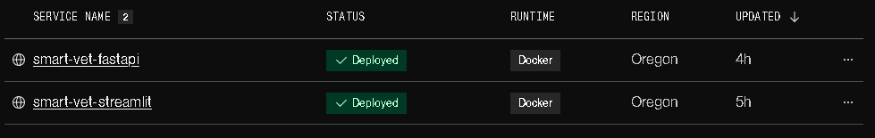
</div>

<br>

OBS: cloud render suspende o serviço se ficar 15 minutos sem inatividade use o uptimerobot para fazer pings e requisições para o serviço do cloud render a cada 14 minutos para evitar o serviço se auto suspender, plano gratuito do cloud render é válido por 1 mês.
- link: https://uptimerobot.com/

<div align="center">
  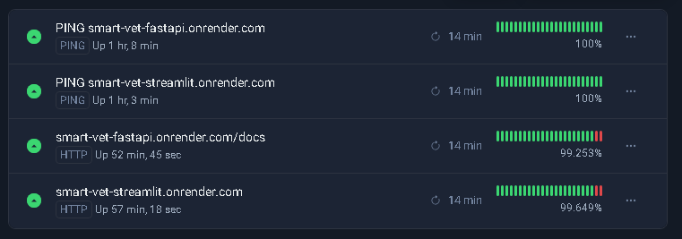
</div>

---

# ⚙️ Executando o Projeto Localmente

## Ambiente Virtual (via scripts automáticos)

O projeto possui scripts prontos para criação e ativação do ambiente virtual.

### Windows

```bash
cd src
.\windows.bat
```

### Linux

```bash
cd src
chmod +x linux.sh
./linux.sh
```

Para desativar o ambiente virtual:

```bash
deactivate
```

---

## Ambiente Virtual (manual)

Caso prefira configurar manualmente:

### Backend (FastAPI)

```bash
cd src/back-end/fastapi

# Criar ambiente virtual
python -m venv .venv
```

#### Windows (PowerShell)

```bash
.\.venv\Scripts\Activate.ps1
```

#### Linux / MacOS

```bash
source .venv/bin/activate
```

Instalar dependências:

```bash
pip install -r requirements.txt
```

Executar API:

```bash
uvicorn main:app --reload
```

Acesse:

```bash
http://localhost:8000/docs
```

* [Acessar FastAPI Local Docs](http://localhost:8000/docs)

---

### Frontend (Streamlit)

```bash
cd src/front-end/streamlit
```

Instalar dependências:

```bash
pip install -r requirements.txt
```

Executar aplicação:

```bash
streamlit run app.py
```

Acesse:

```bash
http://localhost:8501
```

* [Acessar Streamlit Local App](http://localhost:8501/)

---

# 🤗 Download de Modelos e Datasets (Hugging Face)

Caso queira baixar os modelos treinados e datasets localmente.

## Instalar Hugging Face CLI

### Windows (PowerShell)

```powershell
powershell -ExecutionPolicy ByPass -c "irm https://hf.co/cli/install.ps1 | iex"
```

### Linux / MacOS

```bash
pip install -U "huggingface_hub[cli]"
```

---

## 📦 Smart VET Tabular

### Modelo treinado

```bash
hf download guicon/techchallenge-animal-condition-model \
  --local-dir ./downloads/smart-vet-model-tabular
```

### Dataset tabular

```bash
hf download guicon/techchallenge-animal-condition-dataset \
  --repo-type dataset \
  --local-dir ./downloads/smart-vet-dataset-tabular
```

---

## 🖼️ Smart VET Vision

### Modelo treinado

```bash
hf download ramoncg/techchallenge-pet-computer-vision-model \
  --local-dir ./downloads/smart-vet-model-vision
```

### Dataset vision

```bash
hf download ramoncg/techchallenge-animal-race-and-disease-dataset \
  --repo-type dataset \
  --local-dir ./downloads/smart-vet-dataset-vision
```

---

## 📁 Estrutura esperada após download

```bash
downloads/
├── smart-vet-model-tabular/
├── smart-vet-dataset-tabular/
├── smart-vet-model-vision/
└── smart-vet-dataset-vision/
```

---

## 📌 Requisitos

- Python **3.13.14**
- Pip atualizado
- Git instalado
- Conta no Hugging Face (opcional para modelos privados)

Atualizar pip:

```bash
python -m pip install --upgrade pip
```

---

# 📚 Glossário

<div align="center">

Certos termos são utilizados ao longo do projeto **Smart VET** com significados técnicos específicos. Abaixo estão os principais conceitos aplicados no desenvolvimento:

| Termo | Descrição |
|-------|-----------|
| **EfficientNetV2-B0** | Arquitetura de rede neural convolucional otimizada para classificação de imagens, utilizada como modelo principal no Smart VET Vision para identificação de raças e triagem dermatológica. |
| **MobileNetV2** | Rede neural convolucional leve utilizada como modelo auxiliar para filtragem de imagens fora do escopo (ex.: detecção de felinos antes da classificação principal de cães). |
| **Cloud Render** | Plataforma de deploy em nuvem utilizada para hospedar os serviços do projeto, incluindo API FastAPI e interface Streamlit. |
| **Hugging Face** | Plataforma usada para armazenar, versionar e distribuir modelos treinados e datasets do projeto Smart VET. |
| **Model Tabular** | Modelo de Machine Learning treinado sobre dados estruturados (AnimalName + sintomas), responsável pela classificação binária de casos perigosos ou não perigosos. |
| **Model Vision** | Modelo de visão computacional treinado com imagens de cães para classificação de raças e identificação de doenças dermatológicas. |
| **Roboflow** | Plataforma utilizada para organização, anotação e gerenciamento de datasets de imagens no pipeline de visão computacional. |
| **Kaggle** | Plataforma de datasets e competições utilizada como fonte complementar de bases de imagens para treinamento do modelo Smart VET Vision. |
| **CNN (Convolutional Neural Network)** | Tipo de rede neural especializada em processamento de imagens, base do modelo de visão computacional do projeto. |
| **TensorFlow** | Framework de Deep Learning utilizado para construção, treinamento e inferência dos modelos de visão computacional. |
| **FastAPI** | Framework Python utilizado para construção da API backend do Smart VET, responsável por servir modelos e processar inferências. |
| **Streamlit** | Framework Python utilizado para criar a interface web interativa do projeto, permitindo testes de inferência em tempo real. |
| **Transfer Learning** | Técnica de reaproveitamento de modelos pré-treinados (como EfficientNet) para acelerar treinamento e melhorar performance em datasets menores. |
| **Fine-tuning** | Etapa de refinamento de um modelo pré-treinado, onde camadas superiores são descongeladas para ajuste mais específico ao problema. |
| **Data Augmentation** | Técnica de aumento artificial do dataset com transformações como rotação, zoom e espelhamento para melhorar generalização. |
| **OneHotEncoder** | Técnica usada no modelo tabular para transformar variáveis categóricas em representações numéricas compreensíveis pelos algoritmos. |
| **StandardScaler** | Técnica de normalização aplicada às variáveis numéricas do modelo tabular para padronizar escalas de entrada. |
| **Pipeline** | Fluxo automatizado que organiza etapas como pré-processamento, treinamento, validação e inferência. |
| **Recall** | Métrica fundamental no Smart VET Tabular, usada para medir quantos casos perigosos foram corretamente identificados pelo modelo. |
| **ROC AUC** | Métrica que avalia a capacidade geral do modelo em separar corretamente as classes positiva e negativa. |
| **Overfitting** | Situação em que o modelo aprende excessivamente os dados de treino e perde capacidade de generalização. |
| **Inference (Inferência)** | Processo de utilização do modelo treinado para realizar previsões sobre novos dados ou imagens enviadas pelo usuário. |
| **Dataset** | Conjunto de dados utilizado para treinamento, validação e testes dos modelos de IA. |
| **Batch Size** | Quantidade de amostras processadas por vez durante o treinamento do modelo. No Smart VET Vision foi utilizado batch size 64. |
| **Prefetch / Cache / Shuffle** | Técnicas de otimização de leitura e carregamento de dados no TensorFlow para acelerar treinamento. |
| **Triagem Assistida** | Processo de apoio inicial à decisão clínica/veterinária utilizando IA, sem substituir a avaliação profissional. |

</div>

---

# 📋 Referências


* 🐕 [Animal Disease Dataset (Kaggle)](https://www.kaggle.com/datasets/gracehephzibahm/animal-disease)
* 🐶 [Dogs Skin Diseases Dataset (Kaggle)](https://www.kaggle.com/datasets/youssefmohmmed/dogs-skin-diseases-image-dataset/data)
* 🐾 [Oxford Pets Dataset (Hugging Face)](https://huggingface.co/datasets/enterprise-explorers/oxford-pets)
* 🎯 [Stanford Dogs Dataset (Roboflow)](https://universe.roboflow.com/lake-test-company/stanford-dogs-dataset-classification/dataset/1)
* ☁️ [Google Drive Assets](https://drive.google.com/drive/folders/1mlYtnpgYXfrrso4LYhhCJgzXXnEnjpGe)
* 🌐 [Smart VET Streamlit Cloud](https://smartvet-tech.streamlit.app/)
* 🐙 [Fork / Backup Repository](https://github.com/pcastilho04/Smart_Vet)
* ⚙️ [Documentação Oficial FastAPI](https://fastapi.tiangolo.com/)
* ⚙️ [Ambientes Virtuais no FastAPI](https://fastapi.tiangolo.com/virtual-environments/#create-a-virtual-environment)
* 🤗 [Tadriaonet Models](https://huggingface.co/tadrianonet)
* 🐍 [Python 3.13.14 Release Notes](https://www.python.org/downloads/release/python-31314/)
* 💻 [Visual Studio Code](https://code.visualstudio.com/)
* 🐳 [Docker Desktop](https://www.docker.com/products/docker-desktop/)
* ☁️ [Render Cloud Platform](https://render.com/)
* 🔑 [Hugging Face Tokens](https://huggingface.co/settings/tokens)
* 🎯 [Roboflow API Settings](https://app.roboflow.com/ramons-workspace-fyurn/settings/api)
* 📦 [Kaggle API Settings](https://www.kaggle.com/settings/api)
* 🧠 [SHAP Explainability Docs](https://shap.readthedocs.io/en/latest/)
* 📊 [Storytelling with Data – Chart Guide](https://www.storytellingwithdata.com/chart-guide)
* 📉 [Matplotlib Charts Cheatsheet](https://www.kaggle.com/code/themlphdstudent/cheatsheet-matplotlib-charts)
* 📚 [FIAP IA DEVS Computer Vision Repository](https://github.com/FIAP/IADEVS_COMPUTERVISION)
* 📓 [FIAP Classification Iris Notebook](https://github.com/pnferreira/fiap-ia-devs/blob/main/classificacao_iris.ipynb)
* 📖 [Animal Classification Research](https://nebigdatahub.org/animal-classification/)
* 🏥 [Dados Abertos Saúde Gov](https://dadosabertos.saude.gov.br/dataset)
* 🔬 [PubMed Research Database](https://pubmed.ncbi.nlm.nih.gov/)
* 📑 [Research Article – Veterinary Analysis](https://acnsci.org/journal/index.php/jec/article/view/905)
* 📚 [Zenodo Research Repository](https://zenodo.org/)
* 📖 [ResearchGate Data Augmentation](https://www.researchgate.net/figure/Overview-of-the-non-geometric-data-augmentations_fig2_366983637)
* 🤖 [Google Teachable Machine](https://teachablemachine.withgoogle.com/train)
* 📊 [K-Means Iris Example](https://www.kaggle.com/code/khotijahs1/k-means-clustering-of-iris-dataset)
* ❤️ [Heart Failure Prediction Example](https://www.kaggle.com/code/nayansakhiya/heart-fail-analysis-and-quick-prediction)
* ❤️ [Heart Failure Clinical Dataset](https://www.kaggle.com/datasets/andrewmvd/heart-failure-clinical-data)
* 🎬 [IMDB Dataset (Hugging Face)](https://huggingface.co/datasets/stanfordnlp/imdb)
* 📈 [Regression Metrics Article](https://medium.com/data-hackers/prevendo-n%C3%BAmeros-entendendo-m%C3%A9tricas-de-regress%C3%A3o-35545e011e70)
* 📊 [Normal Distribution Concepts](https://analystprep.com/cfa-level-1-exam/quantitative-methods/key-properties-normal-distribution/)
* 📈 [Data Augmentation Techniques](https://www.cudocompute.com/blog/data-augmentation-techniques-for-better-model-performance)
* ☁️ [Render Dashboard](https://dashboard.render.com/)
* 📊 [UptimeRobot Dashboard](https://dashboard.uptimerobot.com/monitors)
* 🐙 [GitHub Login](https://github.com/login)
* 📂 [Gitignore Generator](https://www.toptal.com/developers/gitignore)
* 📒 [Google Colab](https://colab.research.google.com/)
* 🎥 [OBS Studio](https://obsproject.com/pt-br/download)
* ⌨️ [https://github.com/DenverCoder1/readme-typing-svg](https://github.com/DenverCoder1/readme-typing-svg) 
* 📈 [https://mermaid.live/](https://mermaid.live/) 

---

# 📝 Autores

<div align="center">
  <table>
    <tr>
      <td>
        <div align="center">
          <a href="https://github.com/RamonCintas" target="_blank">
            
          </a><br>
          <a href="https://github.com/RamonCintas" target="_blank">
            
          </a>
          <a href="https://www.linkedin.com/in/ramoncintas" target="_blank">
            
          </a><br>
          <details>
            <summary>Descrição da Imagem</summary>
            Esta imagem mostra a foto de perfil de Ramon Cintas no GitHub. Os badges direcionam para GitHub e LinkedIn.
          </details>
        </div>
      </td>
      <td>
        <div align="center">
          <a href="https://github.com/eduardocoimbramattos" target="_blank">
            
          </a><br>
          <a href="https://github.com/eduardocoimbramattos" target="_blank">
            
          </a>
          <a href="https://www.linkedin.com/in/eduardo-coimbra-mattos-9a3a82247" target="_blank">
            
          </a><br>
          <details>
            <summary>Descrição da Imagem</summary>
            Esta imagem mostra a foto de perfil de Eduardo Coimbra no GitHub. Os badges direcionam para GitHub e LinkedIn.
          </details>
        </div>
      </td>
    </tr>
    <tr>
      <td>
        <div align="center">
          <a href="https://github.com/pcastilho04" target="_blank">
            
          </a><br>
          <a href="https://github.com/pcastilho04" target="_blank">
            
          </a>
          <a href="https://www.linkedin.com/in/paulo-de-castilho-82022249" target="_blank">
            
          </a><br>
          <details>
            <summary>Descrição da Imagem</summary>
            Esta imagem mostra a foto de perfil de Paulo Castilho no GitHub. Os badges direcionam para GitHub e LinkedIn.
          </details>
        </div>
      </td>
      <td>
        <div align="center">
          <a href="https://github.com/Condini" target="_blank">
            
          </a><br>
          <a href="https://github.com/Condini" target="_blank">
            
          </a>
          <a href="https://linkedin.com/in/guilherme-condini" target="_blank">
            
          </a><br>
          <details>
            <summary>Descrição da Imagem</summary>
            Esta imagem mostra a foto de perfil de Guilherme Condini no GitHub. Os badges direcionam para GitHub e LinkedIn.
          </details>
        </div>
      </td>
    </tr>
  </table>
</div>

---

# ⚖️ Licença

<div align="center">

Projeto licenciado sob a [MIT License](./LICENSE) Copyright [© Smart VET - Tech Challenge - Fase 1 - Todos os direitos reservados](https://github.com/RamonCintas).

</div>

<p align="right">(<a href="#readme-top">Voltar ao topo</a>)</p>

---
