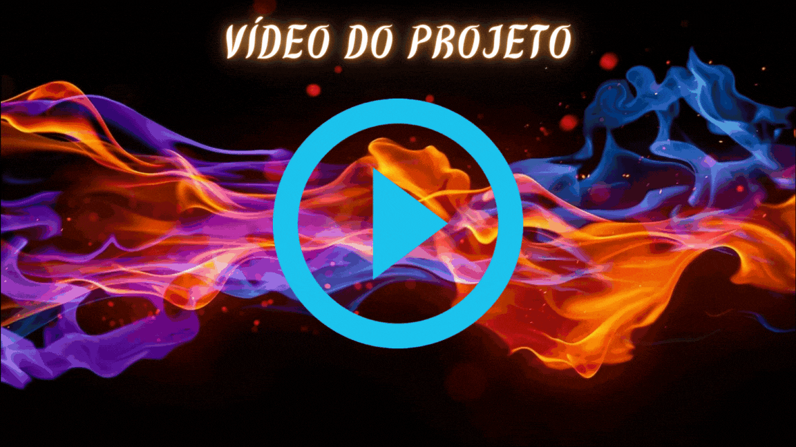

# ⚡ SmartVET – Sistema Inteligente de Apoio à Triagem Veterinária

Documentação e evolução do projeto divididas em fases.

Cada etapa do projeto está organizada em arquivos separados para facilitar a navegação e o acompanhamento da evolução.

## 🏁 Fases

- [Fase 1](./FASE1.MD) — Disponível
- [Fase 2](./FASE2.MD) — Disponível

# 🖥️ Endpoints

* 🌐 [Smart VET Streamlit Render](https://techchallenge-smartvet-streamlit-oficial.onrender.com)
* 🌐 [Smart VET FastAPI Render](https://techchallenge-smartvet-fastapi-oficial.onrender.com/docs) 
> obs: Para testar o fastapi na rota /docs via Swagger use a API KEY (12092002)

---

# 📽️ Video

* 🚀 [Video Smart VET no youtube](https://youtu.be/GYNvZagiY-A)

  
Descrição da Imagem

  Esta imagem contém o logotipo do YouTube em movimento, sugerindo que o usuário pode clicar para assistir ao vídeo do projeto. O logotipo está centralizado, e o GIF cria uma sensação de interatividade. Ao clicar na imagem, o usuário será redirecionado para o vídeo do projeto no YouTube.

